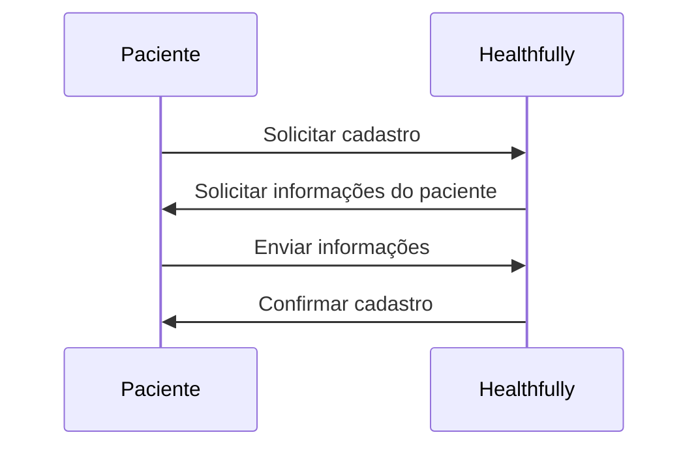
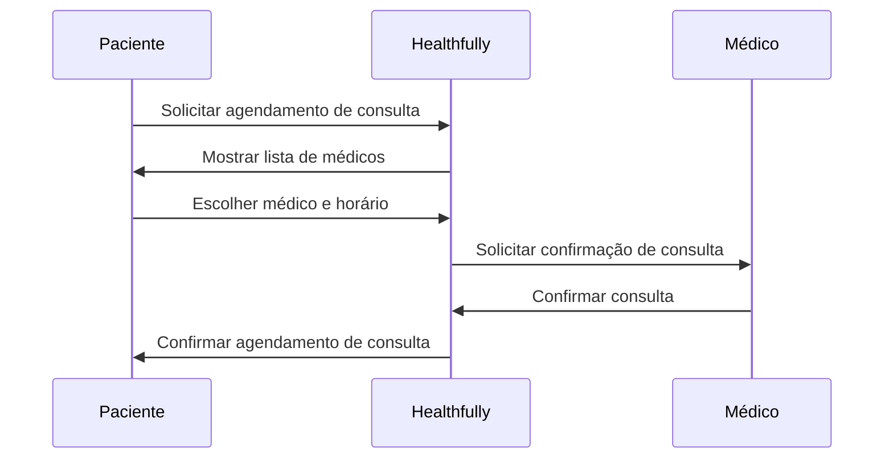
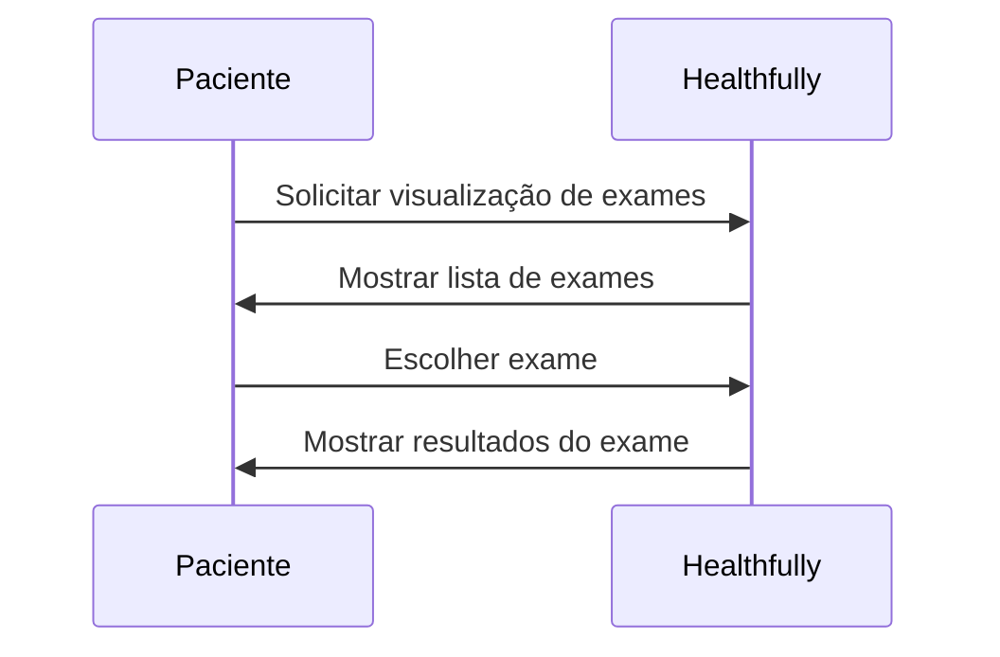
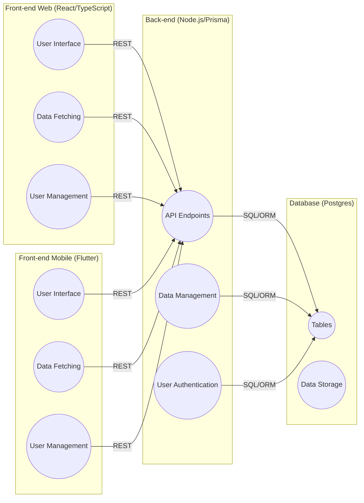
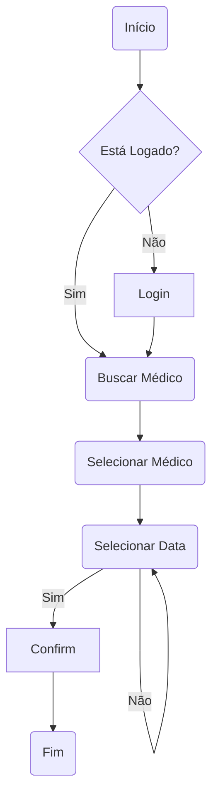

## Diagrama de sequência
### Cadastro de paciente

```mermaid
sequenceDiagram
    participant Paciente
    participant Healthfully
    Paciente->>Healthfully: Solicitar cadastro
    Healthfully->>Paciente: Solicitar informações do paciente
    Paciente->>Healthfully: Enviar informações
    Healthfully->>Paciente: Confirmar cadastro
```

### Agendamento de consulta

```mermaid
sequenceDiagram
    participant Paciente
    participant Healthfully
    participant Médico
    Paciente->>Healthfully: Solicitar agendamento de consulta
    Healthfully->>Paciente: Mostrar lista de médicos
    Paciente->>Healthfully: Escolher médico e horário
    Healthfully->>Médico: Solicitar confirmação de consulta
    Médico->>Healthfully: Confirmar consulta
    Healthfully->>Paciente: Confirmar agendamento de consulta
```
### Visualização de resultados de exames

```mermaid
sequenceDiagram
    participant Paciente
    participant Healthfully
    Paciente->>Healthfully: Solicitar visualização de exames
    Healthfully->>Paciente: Mostrar lista de exames
    Paciente->>Healthfully: Escolher exame
    Healthfully->>Paciente: Mostrar resultados do exame
```

## Diagrama de Componentes

```mermaid
graph LR
    subgraph "Front-end Web (React/TypeScript)"
        A1((User Interface))
        A2((Data Fetching))
        A3((User Management))
    end

    subgraph "Front-end Mobile (Flutter)"
        B1((User Interface))
        B2((Data Fetching))
        B3((User Management))
    end

    subgraph "Back-end (Node.js/Prisma)"
        C1((API Endpoints))
        C2((Data Management))
        C3((User Authentication))
    end

    subgraph "Database (Postgres)"
        D1((Tables))
        D2((Data Storage))
    end

    A1-->|REST|C1
    A2-->|REST|C1
    A3-->|REST|C1

    B1-->|REST|C1
    B2-->|REST|C1
    B3-->|REST|C1

    C1-->|SQL/ORM|D1
    C2-->|SQL/ORM|D1
    C3-->|SQL/ORM|D1

  
```

## Diagrama de Atividades

```mermaid
graph TD
    Start(Início) --> IsLoggedIn{Está Logado?}
    IsLoggedIn -- Sim --> Search(Buscar Médico)
    IsLoggedIn -- Não --> Login
    Login --> Search
    Search --> SelectDoctor(Selecionar Médico)
    SelectDoctor --> IsAvailable(Selecionar Data)
    IsAvailable -- Sim --> Confirm
    IsAvailable -- Não --> IsAvailable
    Confirm --> End(Fim)
```

