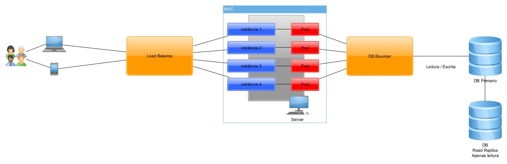

# ARQUITETURA-DE-SOFTWARE-2023
## Healthfully

O projeto Healthfully é um sistema de informação que visa apoiar a implementação do direito à saúde previsto no artigo 196 da Constituição Federal do Brasil. Ele tem como objetivo garantir o acesso universal e igualitário às ações e serviços de promoção, proteção e recuperação da saúde, tanto por meio de serviços públicos como privados.
O Healthfully é composto por diferentes elementos, incluindo unidades de saúde, profissionais da área médica, políticas e processos que regulamentam a interação dos usuários com o sistema, um banco de dados que armazena e disponibiliza informações relevantes, e uma infraestrutura de tecnologia da informação que suporta o funcionamento do sistema.

## 👨‍💻 Autores

* [PHELIPE GABRIEL DE SOUZA CECILIO](https://github.com/PhelipeCecilio)
* [RANDERSON FRANCELES DE SOUSA FONCECA](https://github.com/RandersonF)
* [TAYNA CRISLLEN JOSE DE SANTANA](https://github.com/taynasantana)
  
## 📗 Histórias de usuário

https://github.com/users/PhelipeCecilio/projects/2/views/1

## Escolha da arquitetura
* MVC
* Cliente-Servidor

## Diagrama infraestrutura

